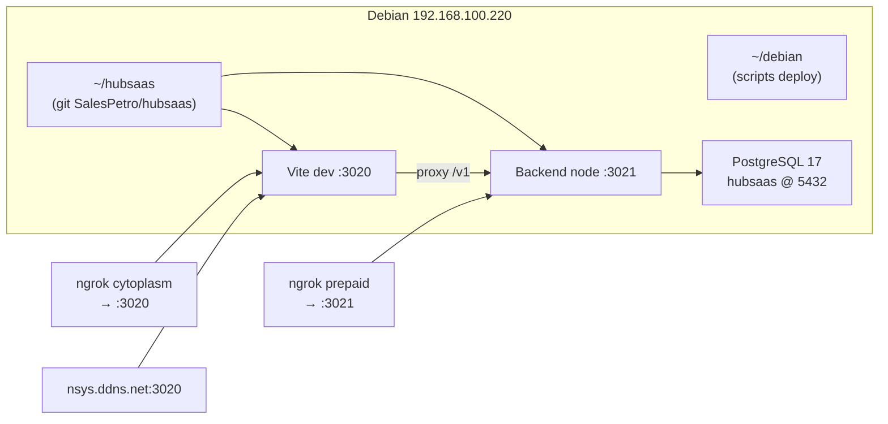

# Corrigir login VPS via .env (sem modificar hubsaas)

## Onde está instalado



| Componente | Caminho / porta |
|------------|-----------------|
| App (git) | `~/hubsaas` |
| Scripts deploy | `~/debian` |
| Backend | `node .build/apps/backend/main.js` → **3021** |
| Frontend | `pnpm dev` (Vite) → **3020** |
| Backup `.env` (update.sh) | `~/.hubsaas-backup/` |

## Diagnóstico — por que não loga no browser

Testes no VPS **agora** passam (`test-vite-proxy.py`, `test-tenant-slug.py`):

- `platform@hubsaas.local` + `demo1234` + tenant `hubsaas` → **200 OK**
- tenant `demo-alpha` → **401** (não existe no banco restaurado)

O [`LoginForm.tsx`](c:/meus-projetos/hubsaas/apps/frontend/src/features/auth/components/LoginForm.tsx) chama `login-context` e usa o tenant retornado — **não** depende só do `.env` no submit. Mesmo assim, falhas comuns:

### 1. E-mail errado (ngrok)

Na captura de tela do ngrok aparece **`platform@hubsaas.com`**. No banco existe **`platform@hubsaas.local`**. Domínio `.com` → `login-context` falha → mensagem genérica *"Falha ao fazer login"*.

### 2. `.env` local desatualizado

[`hubsaas/apps/frontend/.env`](c:/meus-projetos/hubsaas/apps/frontend/.env) ainda tem:

```env
VITE_DEFAULT_TENANT_SLUG=demo-alpha
VITE_API_URL=http://localhost:3021/v1/
```

Isso quebra chamadas **pós-login** via [`tenant-slug.ts`](c:/meus-projetos/hubsaas/apps/frontend/src/lib/tenant-slug.ts) (`sessionStorage` ou fallback `demo-alpha`).

### 3. `update.sh` restaura backup antigo

Após `git pull`, o [`update.sh`](c:/meus-projetos/debian/update.sh) recopia `~/.hubsaas-backup/apps_frontend_.env`. Se o backup ainda tiver `demo-alpha`, reverte correções a cada deploy.

### 4. Ngrok free + browser (cytoplasm)

O frontend **não** envia header `ngrok-skip-browser-warning` em [`api.ts`](c:/meus-projetos/hubsaas/apps/frontend/src/lib/api.ts). Scripts Python passam porque adicionam o header ([`test-ngrok-header.py`](c:/meus-projetos/debian/test-ngrok-header.py)). Pode causar falha intermitente no ngrok; **correção definitiva exige mudança no hubsaas** (fora do escopo). Login via **nsys** não tem esse problema.

### 5. Setup dual ngrok — é possível?

Sim, com o modelo atual:

| Túnel | URL | Porta | Uso |
|-------|-----|-------|-----|
| Backend | `https://prepaid-untying-capsule.ngrok-free.dev` | 3021 | API direta (Swagger, integrações) |
| Frontend | `https://cytoplasm-quicken-asparagus.ngrok-free.dev` | 3020 | UI + proxy `/v1/` → 3021 |
| LAN | `http://nsys.ddns.net:3020` | 3020 | UI + mesmo proxy |

- **CORS**: backend usa `origin: true` ([`main.ts`](c:/meus-projetos/hubsaas/apps/backend/src/main.ts)) — ambos frontends podem chamar a API.
- **`FRONTEND_URL` (única)**: usar **cytoplasm** (frontend ngrok) para OAuth/links Shopee; prepaid é só túnel da API.
- **`vite.config.ts` no VPS**: já patchado (backup) com `proxyTarget` para `VITE_API_URL=/v1/` e `allowedHosts` incluindo `nsys.ddns.net`.

---

## Valores alvo dos `.env`

### Backend — [`env-servidor/apps/backend/.env`](c:/meus-projetos/debian/env-servidor/apps/backend/.env) e [`hubsaas/apps/backend/.env`](c:/meus-projetos/hubsaas/apps/backend/.env)

Manter/alinhar (já quase corretos):

```env
DATABASE_HOST=127.0.0.1          # VPS; localhost no PC local
DATABASE_MIGRATIONS_RUN=true     # VPS; false no PC local (opcional)

FISCAL_ENCRYPTION_KEY=a1b2c3d4e5f6789012345678901234567890abcdef1234567890abcdef123456

# OAuth / webhooks — URL pública do FRONTEND ngrok (cytoplasm)
FRONTEND_URL=https://cytoplasm-quicken-asparagus.ngrok-free.dev
SHOPEE_REVIEW_WEBHOOK_BASE_URL=https://cytoplasm-quicken-asparagus.ngrok-free.dev
SHOPEE_REVIEW_ML_REDIRECT_URI=https://cytoplasm-quicken-asparagus.ngrok-free.dev/v1/channels/oauth/mercadolivre/callback

AUTH_BOOTSTRAP_ENABLED=false
AUTH_BOOTSTRAP_AUTO_TENANT=false
```

Comentário no `.env`: túnel **prepaid** = API direta `:3021`; não substituir `FRONTEND_URL`.

### Frontend — [`env-servidor/apps/frontend/.env`](c:/meus-projetos/debian/env-servidor/apps/frontend/.env)

```env
PORT=3020
VITE_API_URL=/v1/
VITE_DEFAULT_TENANT_SLUG=hubsaas
```

### Frontend — [`hubsaas/apps/frontend/.env`](c:/meus-projetos/hubsaas/apps/frontend/.env) (PC local)

```env
PORT=3020
VITE_API_URL=http://localhost:3021/v1/    # dev local direto
VITE_DEFAULT_TENANT_SLUG=hubsaas            # alinhar com banco restaurado
```

---

## Aplicar no VPS (após editar arquivos)

1. Copiar templates para o servidor:
   ```bash
   scp env-servidor/apps/backend/.env celio@192.168.100.220:~/hubsaas/apps/backend/.env
   scp env-servidor/apps/frontend/.env celio@192.168.100.220:~/hubsaas/apps/frontend/.env
   ```

2. **Atualizar backup** para o `update.sh` não reverter:
   ```bash
   cp ~/hubsaas/apps/backend/.env  ~/.hubsaas-backup/apps_backend_.env
   cp ~/hubsaas/apps/frontend/.env ~/.hubsaas-backup/apps_frontend_.env
   ```

3. **Reiniciar** (Vite só lê `VITE_*` no startup):
   ```bash
   cd ~/debian && bash update.sh
   # ou só reinício:
   pkill -f 'vite|main.js'; # e subir backend + frontend como no update.sh passo 6
   ```

4. **No browser**: limpar `sessionStorage` (F12 → Application → `hubsaas_tenant_slug`) ou aba anônima.

---

## Credenciais corretas (banco restaurado)

| Campo | Valor |
|-------|--------|
| E-mail | `platform@hubsaas.local` (não `.com`) |
| Senha | `demo1234` |
| Tenants | `hubsaas`, `shopee-review` |

URLs de teste:

- http://nsys.ddns.net:3020/login
- https://cytoplasm-quicken-asparagus.ngrok-free.dev/login

Validação rápida no VPS: `python3 ~/test-vite-proxy.py`

---

## Melhoria opcional no repo debian (sem tocar hubsaas)

- Unificar [`configure-hubsaas-env.sh`](c:/meus-projetos/debian/configure-hubsaas-env.sh) para URL **cytoplasm** (hoje usa prepaid antigo).
- Criar `apply-vps-env.sh` que copia `env-servidor/` → `~/hubsaas` + atualiza backup.
- No [`update.sh`](c:/meus-projetos/debian/update.sh), após restaurar backup, avisar se `VITE_DEFAULT_TENANT_SLUG=demo-alpha`.

---

## O que NÃO resolve só com .env

- Header `ngrok-skip-browser-warning` no frontend (requer PR no hubsaas).
- Login com `platform@hubsaas.com`.
- Código usar tenant de `login-context` em vez de fallback `demo-alpha` (PR futuro no hubsaas).
